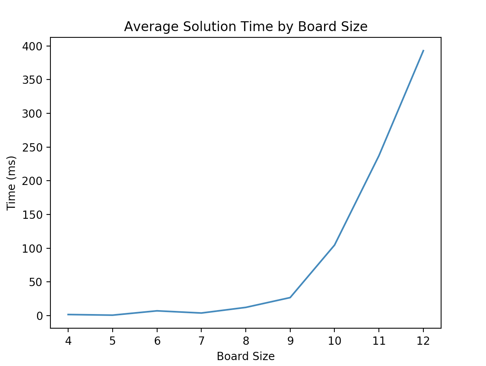

# NQueens

A JavaScript solution to the [NQueens problem](https://en.wikipedia.org/wiki/Eight_queens_puzzle).

## Problem

Place N queens on an NxN chessboard such that no two queens threaten each other - that is, no two queens share a row, column or diagonal.

## Solution

This program uses an iterative-repair style solution using the minimum-conflicts heuristic. As greedy algorithms get stuck on local optima, it may be necessary to reset the initial queen placement several times before finding a solution The steps to the solution are as follows.

1. Semi-randomly place queens on the board (optimized by placing only one queen per row)
2. Find the queen with the most conflicts and move her to the least conflicted tiles on her row.
3. Repeat step 2 until no conflicted queens remain OR if moves are looping (local optimum) return to step 1.

## Complexity

For board sizes 3-12, the average time was recorded for 100 solves. This is plotted below (using Python's matplotlib).

